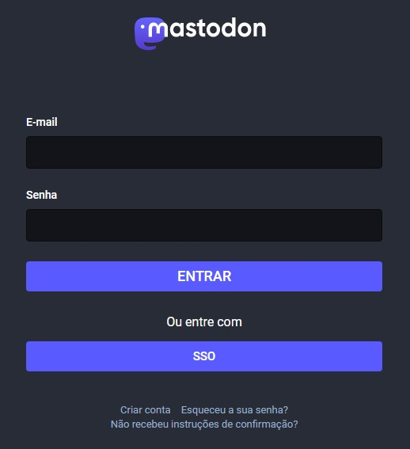
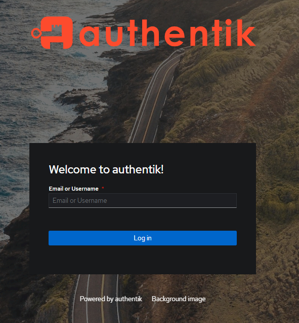

# PoC: Single Sign-On para Manual do Usuário

## Escopo
---
A partir de login via WordPress manter sessão e autenticar o usuário em outros serviços web self-hosted.

## Infraestrutura
---
### Hospedagem

- DigitalOcean

### Protocolos

- SAML
- OpenID Connect (OIDC)

### Gerenciadores de IdP

- WordPress (via plugin)
- Keycloak
- Authentik

## Aplicações
---
1. WordPress: [wp.claromes.live/wp-admin](https://wp.claromes.live/wp-admin)
2. Mastodon: [mastodon.claromes.live](https://mastodon.claromes.live)

### Configurações

- Mastodon
    - SAML setup
    ```
    SAML_ENABLED=true
    SAML_DISPLAY_NAME=<btn-text-here>
    SAML_ACS_URL=<acs-url>
    SAML_ISSUER=<issuer-url>
    SAML_IDP_SSO_TARGET_URL=<login-url>
    SAML_IDP_CERT=-----BEGIN CERTIFICATE-----END CERTIFICATE-----
    SAML_NAME_IDENTIFIER_FORMAT=urn:oasis:names:tc:SAML:1.1:nameid-format:unspecified
    SAML_SECURITY_WANT_ASSERTION_SIGNED=true
    SAML_SECURITY_ASSUME_EMAIL_IS_VERIFIED=false
    SAML_ATTRIBUTES_STATEMENTS_EMAIL=email
    SAML_ATTRIBUTES_STATEMENTS_UID=uid
    SAML_ATTRIBUTES_STATEMENTS_FIRST_NAME=first_name
    SAML_ATTRIBUTES_STATEMENTS_LAST_NAME=last_name
    ```

    - OIDC setup
    ```
    OIDC_ENABLED=true
    OIDC_DISPLAY_NAME=<btn-text-here>
    OIDC_DISCOVERY=true
    OIDC_ISSUER=<issuer-url>
    OIDC_AUTH_ENDPOINT=<auth-url>
    OIDC_TOKEN_ENDPOINT=<token-url>
    OIDC_USER_INFO_ENDPOINT=<user-info-url>
    OIDC_END_SESSION_ENDPOINT=<logout-url>
    OIDC_SCOPE=openid,profile,email
    OIDC_UID_FIELD=preferred_username
    OIDC_CLIENT_ID=<client-id>
    OIDC_CLIENT_SECRET=<client-secret>
    OIDC_REDIRECT_URI=https://<mastodon-url>/auth/auth/openid_connect/callback
    OIDC_SECURITY_ASSUME_EMAIL_IS_VERIFIED=true
    ```

- WordPress
    - "Login using WordPress Users/ SAML" plugin
    ```
    Issuer: https://<wordpress-url>/wp-content/plugins/miniorange-wp-as-saml-idp/
    ACS: https://<service-provider-url>/auth/auth/saml/callback
    NameID format: urn:oasis:names:tc:SAML:1.1:nameid-format:unspecified
    Assertion Signed: check
    Target/ Login: <wordpress-url>
    Mapping:
        - user_login
    ```

- Keycloak

    ```
    docker run --name keycloak_test -p 8080:8080 \
        -e KEYCLOAK_ADMIN=admin -e KEYCLOAK_ADMIN_PASSWORD=admin \
        quay.io/keycloak/keycloak:latest \
        start-dev
    ```

- Authentik

    docker-compose.yml
    ```
    sudo apt-get install -y pwgen

    echo "PG_PASS=$(pwgen -s 40 1)" >> .env
    echo "AUTHENTIK_SECRET_KEY=$(pwgen -s 50 1)" >> .env
    echo "AUTHENTIK_ERROR_REPORTING__ENABLED=true" >> .env

    docker-compose pull
    docker-compose up -d
    ```

## Resultados
---

<p align="center">
    
</p>

### WordPress IdP

#### Prós
- Facilidade de implementação
- Versão gratuita
- Código aberto

#### Contras
- Pouca/ nenhuma configuração de segurança
- Versão premium paga (até 100 usuários $500)
- Somente protocolo SAML
- Configuarções avançadas bloqueadas na versão gratuita

### Keycloak

#### Prós
- Protocolos SAML e OIDC
- Código aberto
- Self-hosted
- Facilidade de implementação para testes
- Boa comunidade

#### Contras
- Implementação em produção complexa

### Authentik

#### Prós
- Protocolos SAML, OIDC, LDAP
- Código aberto
- Self-hosted
- Facilidade de implementação para testes e produção
- Foco em usabilidade

#### Contras
- Produto novo (primeiro release em 2020)

## Considerações
---

O WordPress como gerenciador de IdP funcionaou bem, porém o plugin é limitado, impossibilitando implemetar mais de um protocolo em diversos provedores de serviços (Miniflux, por exemplo, não usa SAML).

<p align="center">
    
</p>

O Aunthentik se mostrou como melhor alternativa para o uso de SSO, fácil de implementar, em constante desenvolvimento, porém a autenticação e banco de dados não será via WordPress. Essa opção seria uma alternativa mais segura e mais customizável.

## Referências
---
```
Mastodon:
https://docs.joinmastodon.org/admin/config/#external-authentication
https://github.com/mastodon/mastodon/pull/16221
https://blog.rosenberg-watt.com/2019/11/15/mastodon-and-keycloak-saml/

Cases:
https://martinfowler.com/articles/your-org-run-mastodon.html

WP:
https://wordpress.org/plugins/daggerhart-openid-connect-generic/#description
https://oa.dnc.global/spip.php?page=unarticle&id_article=112&lang=en
https://github.com/oidc-wp/openid-connect-generic/wiki/Identity-Provider-Configuration:-Keycloak
https://plugins.miniorange.com/wordpress-as-idp#1601869682181-9d7a8e2a-cb26

Keycloat:
https://www.puppeteers.net/how-to-add-openid-to-wordpress-with-keycloak/
http://www.mastertheboss.com/keycloak/keycloak-with-docker/
https://www.keycloak.org/server/containers
https://www.keycloak.org/docs/latest/server_admin/index.html#authenticating

Authentik:
https://blog.cubieserver.de/2022/complete-guide-to-nextcloud-oidc-authentication-with-authentik/
https://goauthentik.io/docs/interfaces/user/customization
```